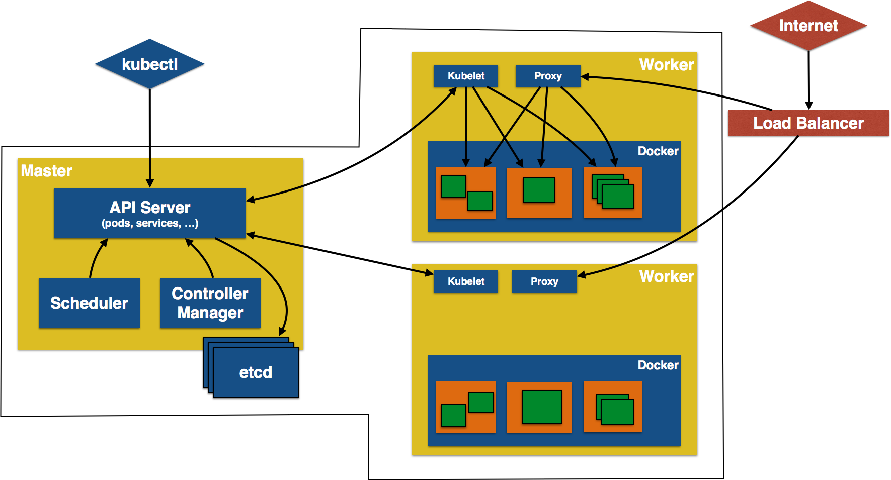

# kubernetes-tutorial

This project shows different recipes to run a Java application using Kubernetes.

## Kubernetes Concepts

Key concepts of Kubernetes are explained below:

- **Pods**: Collocated group of Docker containers that share an IP and storage volume
- **Service**: Single, stable name for a set of pods, also acts as load balancer
- **Replication Controller**: Manages the lifecycle of pods and ensures specified number are running
- **Labels**: Used to organize and select group of objects
- **etcd**: Distributed key-value store used to persist Kubernetes system state
- **Master**: Hosts cluster-level control services, including the API server, scheduler, and controller manager
- **Node**: Docker host running _kubelet_ (node agent) and proxy services
- **Kubelet**: It runs on each node in the cluster and is responsible for node level pod management.

- Kubernetes Architecture


## Create Kubernetes Cluster

### Using Minikube

This will create a one node development cluster.

- Download [latest minikube release](https://github.com/kubernetes/minikube/releases)
- Download [latest kubectl](http://kubernetes.io/docs/getting-started-guides/minikube/#install-kubectl)
- Move both binaries in the same directory and include that directory in the `PATH`.
- Start Kubernetes one node cluster:

```
  minikube start
```

Detailed instructions: http://kubernetes.io/docs/getting-started-guides/minikube/

### Using Kubeadm on Ubuntu Machines

This will create a one master cluster, and will give chance to join other nodes to this cluster.

- Install Kubeadm:
  - One or more machines running one of:
    - Ubuntu 16.04+
  - 2 GB or more of RAM per machine (any less will leave little room for your apps)
  - Swap disabled. You must disable swap in order for the kubelet to work properly.
  - You will install these packages on all of your machines:
    - `kubeadm`: the command to bootstrap the cluster.
    - `kubelet`: the component that runs on all of the machines in your cluter and does things like starting pods and containers.
    - `kubectl`: the command line util to talk to your cluster.
  - To install the `kubeadm`, `kubelet`, `kubectl`:
    - Docker should be installed.
      - `apt-get update`
   	  - `apt-get install -y docker.io`
    - `apt-get update && apt-get install -y apt-transport-https`
    - `curl -s https://packages.cloud.google.com/apt/doc/apt-key.gpg | apt-key add -`
    - `cat <<EOF >/etc/apt/sources.list.d/kubernetes.list`
      - `deb http://apt.kubernetes.io/ kubernetes-xenial main`
      - `EOF`
    - `apt-get update`
    - `apt-get install -y kubelet kubeadm kubectl` 
    - `systemctl daemon-reload`
    - `systemctl restart kubelet`
   
- Creating multi-node cluster:
  - On master node (initialize according to flannel):
    - `sudo kubeadm init --pod-network-cidr=10.244.0.0/16`
  - Before joining a node you need to issue the following commands:
    ```
    - mkdir -p $HOME/.kube
    - sudo cp -i /etc/kubernetes/admin.conf $HOME/.kube/config
    - sudo chown $(id -u):$(id -g) $HOME/.kube/config
    ```
   
 - Deploy a Pod Network:
   ```
   - sudo kubectl apply -f https://raw.githubusercontent.com/coreos/flannel/master/Documentation/kube-flannel.yml
   - sudo kubectl apply -f https://raw.githubusercontent.com/coreos/flannel/master/Documentation/k8s-manifests/kube-flannel-rbac.yml
   ```
   
 - On worker nodes:
   - `kubeadm join --token TOKEN MASTER_IP:PORT` 
- Tear down a cluster:
  - To undo what kubeadm did, you should first drain the node and make sure that the node is empty before shutting it down.
  - Talking to the master with the appropriate credentials, run:
    ```
    - kubectl drain <node name> --delete-local-data --force --ignore-daemonsets
    - kubectl delete node <node name>	
    ```
  - Then, on the node being removed, reset all kubeadm installed state:
    - `kubeadm reset`
	
## Java Application (WildFly + H2 in-memory database)

This section will show how to deploy a Java EE application in a Pod with one Container. WildFly, with an in-memory H2 database, will be used as the container.

- Create Java EE 7 sample application Replication Controller:
```
kubectl create -f javaee7-hol.yaml
replicationcontroller "javaee7-hol" created
```
- Get status of the Pod:
```
kubectl get -w po
NAME                READY     STATUS              RESTARTS   AGE
javaee7-hol-tp574   0/1       ContainerCreating   0          <invalid>
javaee7-hol-tp574   1/1       Running   0         15s
```
NOTE: Make sure to wait for the status to change to `Running`.
- Get status of the Replication Controller:
```
kubectl get rc
NAME          DESIRED   CURRENT   READY     AGE
javaee7-hol   1         1         1         1m
```
- Get all pods:
```
kubectl get pods
NAME                READY     STATUS    RESTARTS   AGE
javaee7-hol-tp574   1/1       Running   0          1m
```
Note down pod's name. This will be used to get logs next.
- Get logs:
```
kubectl logs javaee7-hol-tp574
=========================================================================

  JBoss Bootstrap Environment

  JBOSS_HOME: /opt/jboss/wildfly

. . .

20:30:39,533 INFO  [org.jboss.as.ejb3.deployment.processors.EjbJndiBindingsDeploymentUnitProcessor] (MSC service thread 1-3) JNDI bindings for session bean named SalesFacadeREST in deployment unit deployment "movieplex7-1.0-SNAPSHOT.war" are as follows:

  java:global/movieplex7-1.0-SNAPSHOT/SalesFacadeREST!org.javaee7.movieplex7.rest.SalesFacadeREST
  java:app/movieplex7-1.0-SNAPSHOT/SalesFacadeREST!org.javaee7.movieplex7.rest.SalesFacadeREST
  java:module/SalesFacadeREST!org.javaee7.movieplex7.rest.SalesFacadeREST
  java:global/movieplex7-1.0-SNAPSHOT/SalesFacadeREST
  java:app/movieplex7-1.0-SNAPSHOT/SalesFacadeREST
  java:module/SalesFacadeREST

. . .

20:30:42,865 INFO  [org.wildfly.extension.undertow] (ServerService Thread Pool -- 64) WFLYUT0021: Registered web context: /movieplex7
20:30:42,912 INFO  [org.jboss.as.server] (ServerService Thread Pool -- 37) WFLYSRV0010: Deployed "movieplex7-1.0-SNAPSHOT.war" (runtime-name : "movieplex7-1.0-SNAPSHOT.war")
20:30:43,011 INFO  [org.jboss.as] (Controller Boot Thread) WFLYSRV0060: Http management interface listening on http://127.0.0.1:9990/management
20:30:43,011 INFO  [org.jboss.as] (Controller Boot Thread) WFLYSRV0051: Admin console listening on http://127.0.0.1:9990
20:30:43,011 INFO  [org.jboss.as] (Controller Boot Thread) WFLYSRV0025: WildFly Full 9.0.0.Final (WildFly Core 1.0.0.Final) started in 7898ms - Started 437 of 607 services (233 services are lazy, passive or on-demand)
```
- Access service
  - Cluster using minikube
    - Expose RC as a Service:
```
kubectl expose rc javaee7-hol --name=javaee7-webapp --port=8080 --target-port=8080
```
- Get service configuration:
```
kubectl describe service javaee7-webapp
Name:     javaee7-webapp
Namespace:    default
Labels:     name=javaee7-hol
Annotations:    <none>
Selector:   name=javaee7-hol
Type:     ClusterIP
IP:     100.67.129.51
Port:     <unset> 8080/TCP
Endpoints:    100.96.1.3:8080
Session Affinity: None
Events:     <none>
```

- Scaling a Deployment

You can scale a Deployment by using the following command:

```
kubectl scale deployment javaee7-hol --replicas=10
deployment "javaee7-hol" scaled

kubeadm join 10.32.0.113:6443 --token xdg0to.v2wndgkq96ouk5c4 --discovery-token-ca-cert-hash sha256:8548efe0cbca2787f86b63b9431866e9fe5ac92f859b2ddea311155829035585
```
